<h1 align="center">Hi, I'm Alex</h1>

  <code>front-end developer</code>&nbsp;&nbsp;·&nbsp;&nbsp;<code>russia</code>

  Development is not just about writing code — it's about solving problems and creating meaningful user experiences.

 

  &nbsp;&nbsp;&nbsp;&nbsp;
  &nbsp;&nbsp;&nbsp;&nbsp;
  &nbsp;&nbsp;&nbsp;&nbsp;
  &nbsp;&nbsp;&nbsp;&nbsp;
  &nbsp;&nbsp;&nbsp;&nbsp;
  

 

  

